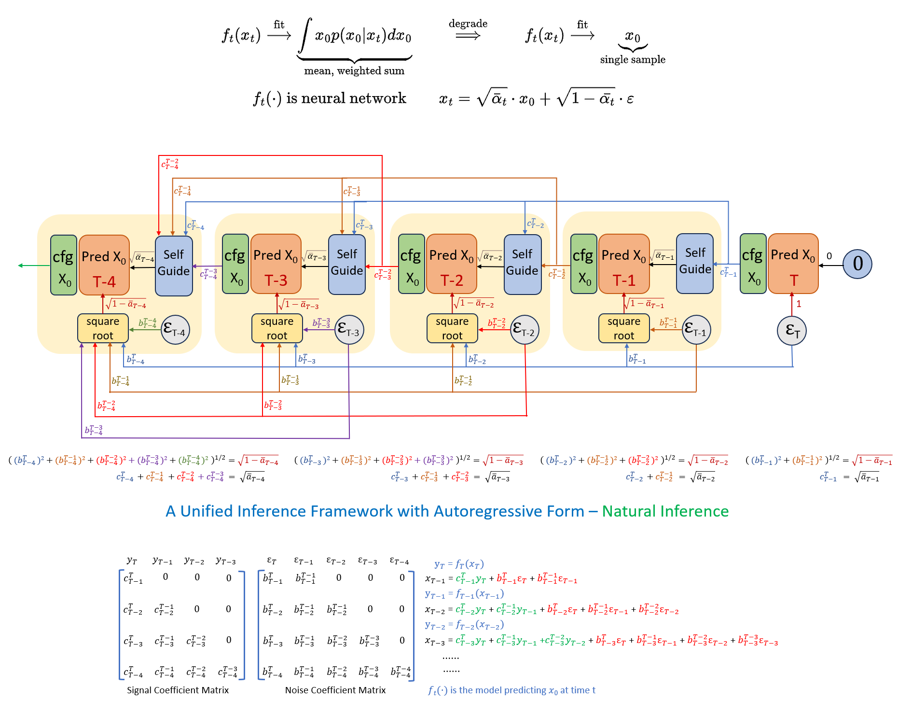

	<h1 style="display:block">
		Rethinking Diffusion Model in High Dimension 
    </h1>

 

### [Paper](https://arxiv.org/abs/2503.08643) 

### A Unified Diffusion Model Inference Framework - Natural Inference

**Natural Inference** is a straightforward and general inference framework that does not rely on any probability concepts. It unifies most mainstream inference methods, including at least:

- &#x2705; DDPM Ancestral Sampling
- &#x2705; DDIM
- &#x2705; SDE Euler
- &#x2705; ODE Euler
- &#x2705; Heun
- &#x2705; DPMSolver
- &#x2705; DPMSolver++
- &#x2705; DEIS
- &#x2705; Flow Matching Euler

### Reproducing 
- For reproducing the results in Section 3.2 - *Weighted Sum Degradation Phenome*, please refer to AnalyzeWeightedSumDegradation.py.
- For reproducing the results in Section 4.3 - *Represent DDPM Ancestral Sampling with Natural Inference Framework*, please refer to AnalyzeDDPMDDIM.py.
- For reproducing the results in Section 4.4 - *Represent DDIM with Natural Inference Framework*, please refer to AnalyzeDDPMDDIM.py.
- For reproducing the results in Section 4.5 - *Represent Flow Matching Euler Sampling with Natural Inference Framework*, please refer to AnalyzeFlowMatching.py.
- For reproducing the results in Section 4.6 - *Represent High Order Samplers with Natural Inference Framework*, please refer to AnalyzeDEIS.py and AnalyzeDPMSolver.py.
- For reproducing the results in Section 5.3 - *A Way to Control Image Sharpness*, please refer to SD3NaturalInference.py.
- For reproducing the results in Section 5.4 - *Better Coefficient Matrix*, please refer to CIFAR10NaturalInference.py.

### Vilidate Consistency

- To Verifying the consistency between the results of the original algorithm and Natural Inference, please refer to ValidateNaturalInference.py.

### Visualize Coefficient Matrix

- To visualizing coefficient matrixs on Natural Inference, please refer to Visualize/VisualizeCoeffMatrix.html. VisualizeCoeffMatrix.html is an standalone web application that can run offline in a browser. You can also open [this link](https://blairstar.github.io/CoeffMatrix/) directly.

